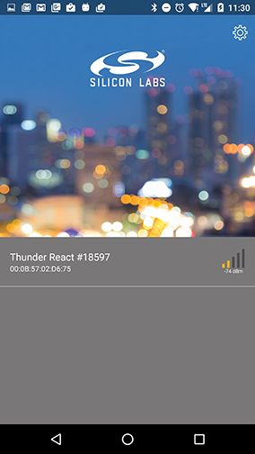
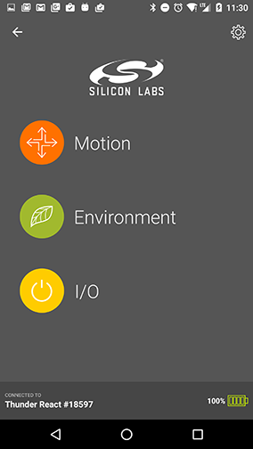
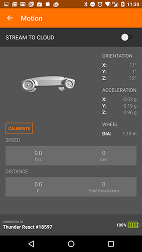
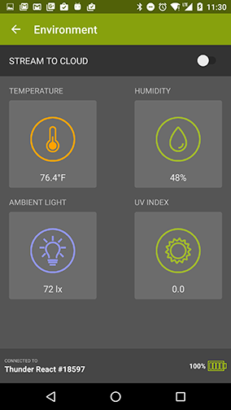
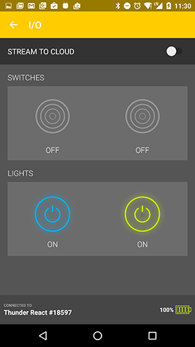
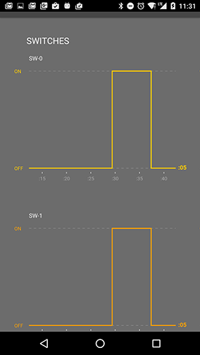

# Thunder Board

ThunderBoard is a native Android app for demonstrating the capabilities of the ThunderBoard-React sensor board. 
It includes Motion, Environment, and I/O demos.

Source code for the [iOS app](https://github.com/SiliconLabs/thunderboard-react-ios) and [Firebase web interface](https://github.com/SiliconLabs/thunderboard-react-web) is also available.

## Screenshots

. 

.
.
_

## 3D

The motion demo of the ThunderBoard application displays a 3D image of a car on the screen. 
This image will rotate about its center, depending on the orientation of the ThunderBoard device.
The activity displays the 3D image using the libGDX library from [Badlogic Games](http://www.badlogicgames.com/wordpress/).

An object file describes the shape of the car, in terms of vectors and polygons. 
This object file, pinewood_car.g3dj was generated using techiques described in this document: [libGDX](https://github.com/libgdx/libgdx/wiki/Importing-Blender-models-in-LibGDX).
 
The original model pinewood_car.obj and the files generated in the process could be found in 3dModels for reference.

## Bluetooth

Bluetooth Low Energy (BLE) is used to communicated with the ThunderBoard-React device. 
Android devices that supports BLE are required to run the ThunderBoard software.

## Beacons

When powered on, ThunderBoard-React devices broadcast an iBeacon-compatible service. 

This makes it possible for the Android device to be notified of a nearby ThunderBoard-React automatically and 
using the notification to connect to the board bypassing the discovery process.

There are a few things about the Android implementation to keep in mind:

1. AltBeacon open source library is used to implement discovering beacons.

2. Notifications are triggered only if beacons are enabled through the application settings.

3. Notifications are triggered only if the Android application runs in a background mode which is determined by the main home screen being destroyed
(normally after pressing the back button on the home screen).

## Cloud Streaming

Each ThunderBoard demo can stream real time data to the cloud. 
While streaming, the web URL displays live-updating graphs for each characteristic of the demo. 
After a demo concludes, summary data is shown.

The cloud streaming feature is built with [Firebase](https://www.firebase.com). 
In order to enable support, you need to update the configuration values in `thunderboard.properties`. 
Specifically, the `cloud.data.url`, `cloud.demo.url`, and `key.firebase` properties need to be created. 
Without these values, the streaming feature will fail.

## Short URLs

ThunderBoard attempts to shorten all demo URLs with the [is.gd](http://is.gd) URL shortening service. 
URL stats are not supported, so no credentials are required for the URL shortener. 

## Building the code

_The ThunderBoard project is build with Android Studio 1.4.1_

## Configuration Values

In the root project directory, create a subdirectory `keystores` and `thunderboard.properties` in it.  

The `thunderboard.properties` file should be updated with configuration values that need to be provided in order for certain features of the application to be enabled (namely, realtime streaming). 
In order to stream realtime data to your own Firebase instance, you'll need to update the following items with your own configuration value:
    
    cloud.data.url=https://your-firebase-application-0001.firebaseio.com/
    cloud.demo.url=https://your-firebase-application-0001.firebaseapp.com/#/
    key.firebase=your-firebase-application-token
    # to sign the app for release, provide these too
    store.file=../keystores/your-store-file.jks
    store.password=your-store-password
    key.alias=your-key-alias
    key.password=your-key-password
    

## Libraries

 * [Timber](http://github.com/JakeWharton/timber)
 * [ButterKnife](http://jakewharton.github.io/butterknife)
 * [Dagger 2](http://google.github.io/dagger/)
 * [RxJava](https://github.com/ReactiveX/RxJava)
 * [RxAndroid](https://github.com/ReactiveX/RxAndroid)
 * [Gson](https://github.com/google/gson)
 * [Firebase](https://www.firebase.com/docs/android/quickstart.html)
 * [Retrofit](http://square.github.io/retrofit)
 * [OkHttp](http://square.github.io/okhttp)
 * [AltBeacon](http://altbeacon.github.io/android-beacon-library/)
 * [libGDX](https://github.com/libGDX/libGDX)

## To Do

 * Use the calibration characteristic to cancel the calibration popup.
 * More demos to come.

## License

    Copyright 2015 Silicon Laboratories

    Licensed under the Apache License, Version 2.0 (the "License");
    you may not use this file except in compliance with the License.
    You may obtain a copy of the License at

       http://www.apache.org/licenses/LICENSE-2.0

    Unless required by applicable law or agreed to in writing, software
    distributed under the License is distributed on an "AS IS" BASIS,
    WITHOUT WARRANTIES OR CONDITIONS OF ANY KIND, either express or implied.
    See the License for the specific language governing permissions and
    limitations under the License.